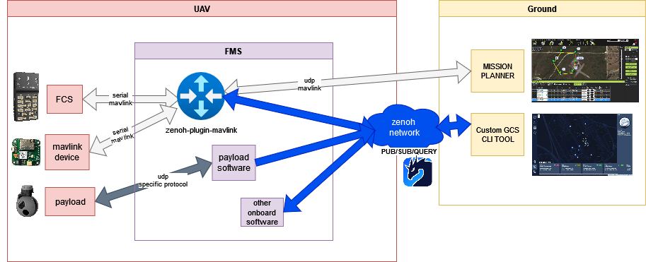

<!---
[](https://github.com/roby2014/zenoh-plugin-mavlink/actions?query=workflow%3ARust)
--->
[](https://github.com/eclipse-zenoh/roadmap/discussions)
[](https://discord.gg/2GJ958VuHs)
[](https://choosealicense.com/licenses/epl-2.0/)
[](https://opensource.org/licenses/Apache-2.0)

# Eclipse Zenoh
The Eclipse Zenoh: Zero Overhead Pub/sub, Store/Query and Compute.

Zenoh (pronounce _/zeno/_) unifies data in motion, data at rest and computations. It carefully blends traditional pub/sub with geo-distributed storages, queries and computations, while retaining a level of time and space efficiency that is well beyond any of the mainstream stacks.

Check the website [zenoh.io](http://zenoh.io) and the [roadmap](https://github.com/eclipse-zenoh/roadmap) for more detailed information.

-------------------------------
# MAVlink plugin and standalone `zenoh-bridge-mavlink`

:point_right: **Build "main" branch:** see [below](#How-to-build-it)

## Background
[MAVLink](https://github.com/mavlink/mavlink) is a very lightweight messaging protocol for communicating with drones (and between onboard drone components).


## Plugin or bridge ?

This software is built in 2 ways to choose from:
 - `zenoh-plugin-mavlink`: a Zenoh plugin - a dynamic library that can be loaded by a Zenoh router
 - `zenoh-bridge-mavlink`: a standalone executable

The features and configurations described in this document applies to both.
Meaning the *"plugin"* and *"bridge"*  words are interchangeables in the rest of this document.

## How to build it

> :warning: **WARNING** :warning: : Zenoh and its ecosystem are under active development. When you build from git, make sure you also build from git any other Zenoh repository you plan to use (e.g. binding, plugin, backend, etc.). It may happen that some changes in git are not compatible with the most recent packaged Zenoh release (e.g. deb, docker, pip). We put particular effort in maintaining compatibility between the various git repositories in the Zenoh project.

> :warning: **WARNING** :warning: : As Rust doesn't have a stable ABI, the plugins should be
built with the exact same Rust version than `zenohd`, and using for `zenoh` dependency the same version (or commit number) than 'zenohd'.
Otherwise, incompatibilities in memory mapping of shared types between `zenohd` and the library can lead to a `"SIGSEV"` crash.

In order to build the zenoh bridge for MAVLink you need first to install the following dependencies:

- [Rust](https://www.rust-lang.org/tools/install). If you already have the Rust toolchain installed, make sure it is up-to-date with:

  ```bash
  $ rustup update
  ```

Once these dependencies are in place, you may clone the repository on your machine:

```bash
$ git clone https://github.com/roby2014/zenoh-plugin-mavlink.git
$ cd zenoh-plugin-mavlink
$ cargo build --release
```

The standalone executable binary `zenoh-bridge-mavlink` and a plugin shared library (`*.so` on Linux, `*.dylib` on Mac OS, `*.dll` on Windows) to be dynamically
loaded by the zenoh router `zenohd` will be generated in the `target/release` subdirectory.

Example:
```bash
$ RUST_LOG=debug cargo run --bin zenoh-bridge-mavlink -- -c DEFAULT_CONFIG.json5
```

-------------------------------
# Usage

The use cases of this Zenoh plugin for MAVLink are various:
- integration of a MAVLink network with a Zenoh System
- scaling a MAVLink system up to the Cloud with Zenoh routers
- integration of Zenoh-based ground stations
- integration with any technology supported by other Zenoh Plugins (MQTT, ROS 2 ...) or Storages technology (InfluxDB, RocksDB)

## Configuration

`zenoh-bridge-mavlink` can be configured via a JSON5 file passed via the `-c` argument. You can see a commented example of such configuration file: [`DEFAULT_CONFIG.json5`](DEFAULT_CONFIG.json5).

The `"mavlink"` part of this same configuration file can also be used in the configuration file for the zenoh router (within its `"plugins"` part). The router will automatically try to load the plugin library (`zenoh-plugin_mavlink`) at startup and apply its configuration.

`zenoh-bridge-mavlink` also accepts the following arguments. If set, each argument will override the similar setting from the configuration file:
 * zenoh-related arguments:
   - **`-c, --config <FILE>`** : a config file
   - **`-m, --mode <MODE>`** : The zenoh session mode. Default: `peer` Possible values: `peer` or `client`.
      See [zenoh documentation](https://zenoh.io/docs/getting-started/key-concepts/#deployment-units) for more details.
   - **`-l, --listen <LOCATOR>`** : A locator on which this router will listen for incoming sessions. Repeat this option to open several listeners. Example of locator: `tcp/localhost:7447`.
   - **`-e, --peer <LOCATOR>`** : A peer locator this router will try to connect to (typically another bridge or a zenoh router). Repeat this option to connect to several peers. Example of locator: `tcp/<ip-address>:7447`.
   - **`--no-multicast-scouting`** : disable the zenoh scouting protocol that allows automatic discovery of zenoh peers and routers.
   - **`-i, --id <hex_string>`** : The identifier (as an hexadecimal string - e.g.: 0A0B23...) that the zenoh bridge must use. **WARNING: this identifier must be unique in the system!** If not set, a random UUIDv4 will be used.
   - **`--rest-http-port <rest-http-port>`** : set the REST API http port (default: 8000)
 * MAVLink-related arguments:
   - TODO

## Architecture details

The plugin is designed to establish parallel connections for each MAVLink endpoint provided,
enabling efficient message distribution across these connections.
Additionally, it incorporates functionality to integrate with the Zenoh network, allowing Zenoh
peers to send and communicate within the MAVLink network, ensuring that messages can flow freely in both directions.

This dual capability enhances interoperability and facilitates robust communication between MAVLink and Zenoh systems.



### IN/OUT Zenoh key expressions

In summary, the message flow is structured as follows:
- The plugin operates with one subscriber and one publisher:
  - Subscriber: `/mavlink/in` - The plugin consumes messages from this key expression and forwards them to the MAVLink network.
  - Publisher: `/mavlink/out` - The plugin publishes messages received from the MAVLink network to this key expression.

### Internal communication

Internally, all I/O operations are executed in parallel, with data synchronization facilitated through
a [broadcast channel](https://docs.rs/tokio/latest/tokio/sync/broadcast/index.html).

## Future

Check the [issues](https://github.com/roby2014/zenoh-plugin-mavlink/issues) and open pull requests if you'd like to contribute!
